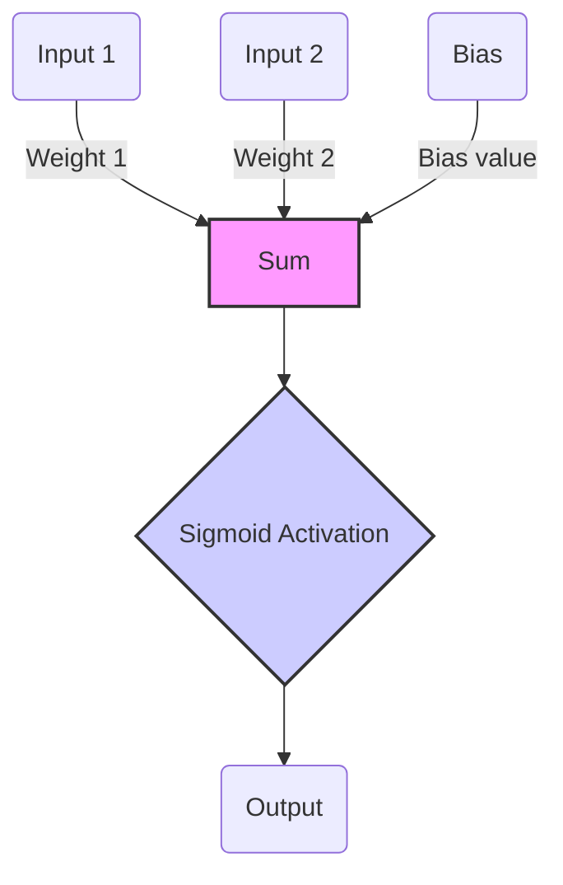

# Logic Gate Neural Network Trainer

## Overview
This project implements a simple neural network to learn the behavior of basic logic gates (AND, OR, NAND, XOR) using Python. The neural network uses a single-layer perceptron model with a sigmoid activation function. The training process uses numerical gradient estimation to update the weights and bias based on the mean squared error cost function.

## Neural Network Architecture
Below is a diagram of the single neuron model used in this project:



This model consists of two input nodes (representing the inputs of the logic gate), each connected to a summing junction through weights. A bias is also added to the sum. The result is passed through a sigmoid activation function, producing the final output.

## Features
- Training neural networks to simulate logic gates.
- Configurable parameters such as learning rate, number of iterations, and epsilon for gradient estimation.
- Easy switching between different logic gate training sets via configuration.

## Installation
No external libraries are required for the main functionality as it uses only NumPy, which can be installed via pip if not already available:

```bash
pip install numpy
```

## Usage
To run the training process, execute the following command in your terminal:

```bash
python main.py
```

## Configuration
Modify the `config.py` file to change the learning parameters or switch between different logic gates. Here’s a brief explanation of the configuration options available.

## Output
After running `main.py`, the terminal will display the cost after each training epoch, along with the final learned weights and biases. It also evaluates the trained model on all possible inputs for the selected logic gate to demonstrate the performance.

## Contributing
Contributions to this project are welcome. Please ensure to keep the structure consistent, and add or update the corresponding configurations and documentation as needed.
